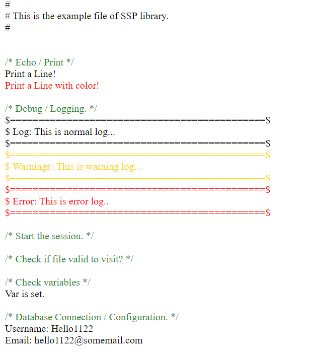

# Simple Safe PHP Example Project #

This is an example project to show how the SSP library can
be functionally working for your project. <br/><br/>

## Libarary Link ##
* https://github.com/jcs090218/Simple-Safe-PHP

## Example Code ##
```
<?php
/**
 * $File: index.php $
 * $Date: 2017-11-14 16:37:15 $
 * $Revision: $
 * $Creator: Jen-Chieh Shen $
 * $Notice: See LICENSE.txt for modification and distribution information
 *                   Copyright (c) 2017 by Shen, Jen-Chieh $
 */


// Include all needed source files.
include_once("./stdafx.php");
include_once("./config/config.php");

echo "# <br/>";
echo "# This is the example file of SSP library.<br/>";
echo "# <br/><br/>";

$titleColor = "#228b22";

SSP\printlnColor("<br/>/* Echo / Print */", $titleColor);
SSP\println("Print a Line!");
SSP\printlnColor("Print a Line with color!", "red");

SSP\printlnColor("<br/>/* Debug / Logging. */", $titleColor);
SSP\log("This is normal log...");
SSP\warning("This is warning log...");
SSP\error("This is error log..");

SSP\printlnColor("<br/>/* Start the session. */", $titleColor);
SSP\safeSessionStart();  // safe way to start the session.

SSP\printlnColor("<br/>/* Check if file valid to visit? */", $titleColor);
SSP\isForbiddenFile("index-fk.php");  // comment or uncomment this line.

SSP\printlnColor("<br/>/* Check variables */", $titleColor);
$checkVar = "username";
$_POST[$checkVar] = 'Hello1122';  // Comment or uncomment to test.

if (SSP\issetPost($checkVar)) {
  SSP\println("Var is set.");
} else {
  SSP\println("Var is not set.");
}

SSP\printlnColor("<br/>/* Database Connection / Configuration. */", $titleColor);

// Connect database.
$conn = SSP\sql_connect($host, $user, $pass, $database);
// Select database.
SSP\sql_select_db($conn, $database);

// Get the username from another page.
$postUsername = SSP\sql_sanitize($conn, SSP\safeGetPost($checkVar));

// Just search one user here..
$sql = "SELECT * FROM `accounts` WHERE `username` = ?";
$stmt = SSP\sql_prepare($conn, $sql);
if (!SSP\sql_prepare_success($stmt)) {
  SSP\error("Cannot prepare statement...");
  return;
}

$stmt->bind_param('s', $postUsername);
$stmt->execute();

$result = SSP\stmt_getResult($stmt);

$stmt->close();

while ($row = SSP\result_getOneRow($result)) {
  SSP\println('Username: '.$row['username']);
  SSP\println('Email: '.$row['email']);
  SSP\println();
}
?>
```

